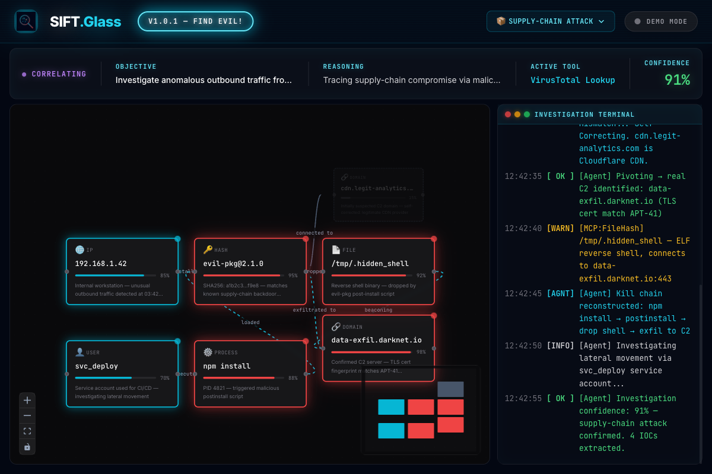
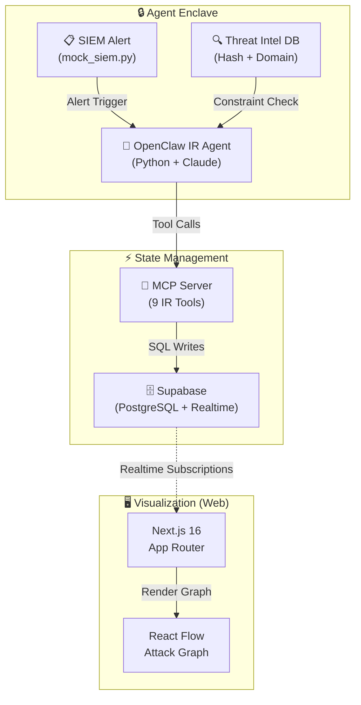

<div align="center">
  <a href="https://youtu.be/fsi0KBf0MBk"></a>
  <h1>SIFT.Glass 🔍</h1>
  <p><em>AI incident response agent that livestreams threat-hunting reasoning to a real-time visual attack graph — built for <strong>FIND EVIL! 2026</strong>.</em></p>

[](https://youtu.be/fsi0KBf0MBk)
[](https://siftglass.edycu.dev)
[](https://devpost.com/software/sift-glass)

[](https://nextjs.org)
[](https://react.dev)
[](https://supabase.com)
<br>
[](https://python.org)
[](https://anthropic.com)
[](https://modelcontextprotocol.io)
[](LICENSE)

</div>

---

## 📸 See it in Action

> **[▶ Watch the full autonomous investigation](https://youtu.be/fsi0KBf0MBk)** — Complete kill chain reconstruction in under 2 minutes.

| Timestamp | What's Happening                                                               |
| --------- | ------------------------------------------------------------------------------ |
| `00:00`   | 🖥️ SOC Dashboard loads — military-grade dark UI with scanning lines            |
| `00:02`   | 🚨 SIEM alert triggers — agent begins autonomous investigation                 |
| `00:25`   | 🤖 OpenClaw agent initializes, starts artifact scanning                        |
| `00:42`   | 🔀 Parallel threat intelligence dispatch across MCP tools                      |
| `01:03`   | ⚡ **AI Self-Correction** — false positive detected and shattered in real-time |
| `01:26`   | 🔗 Full kill chain correlated (97% confidence) — attack graph complete         |
| `01:30`   | 📋 7-step containment playbook auto-generated                                  |

<div align="center">
  
  <p><em>SOC Dashboard: Real-time attack graph with confidence scores, live terminal, and AI reasoning banner</em></p>
</div>

---

## 💡 The Problem & Solution

**The Problem:** Security analysts spend 45+ minutes manually investigating each SIEM alert — correlating logs, querying threat intel APIs, and building kill chain diagrams by hand. SOC teams face alert fatigue with thousands of alerts daily, and the reasoning behind each investigation is lost the moment it ends.

**SIFT.Glass** solves this by deploying an autonomous AI agent (OpenClaw) that **livestreams its entire investigative reasoning** to a real-time React Flow attack graph. Every hypothesis, tool call, and piece of evidence appears live. When the agent detects a false positive, the bad node **shatters** and the agent self-corrects — all visible to the analyst.

**Key Features:**

- ⚡ **Sub-2-Minute Investigations** — Full APT-41 kill chain reconstructed autonomously
- 🧠 **Self-Correcting AI** — Agent detects and eliminates false positives in real-time with visual "shatter" animation
- 📊 **Transparent Reasoning** — Every hypothesis, confidence score, and tool call is visible in the attack graph
- 🔴 **Live Terminal** — Watch the agent's raw thought process as it investigates
- 📋 **Auto-Generated Playbooks** — Investigation concludes with actionable containment steps

---

## 🏗️ Architecture & Tech Stack

| Layer             | Technology                       | Purpose                                |
| ----------------- | -------------------------------- | -------------------------------------- |
| **Frontend**      | Next.js 16, React 19, React Flow | Real-time attack graph visualization   |
| **Styling**       | Tailwind CSS v4                  | Military SOC aesthetic, dark mode      |
| **State**         | Supabase (PostgreSQL + Realtime) | Live event streaming via subscriptions |
| **Agent**         | Python + Claude Sonnet 4         | Autonomous reasoning engine            |
| **Orchestration** | Model Context Protocol (MCP)     | Structured tool calls for IR workflow  |
| **Threat Intel**  | Hash + Domain Constraint DB      | Built-in false-positive detection      |



---

## 🏆 Sponsor Tracks & Bounties

| Sponsor                          | How We Used It                                                                                                                                              | Code Location                                                                        |
| -------------------------------- | ----------------------------------------------------------------------------------------------------------------------------------------------------------- | ------------------------------------------------------------------------------------ |
| **Model Context Protocol (MCP)** | Custom MCP-based tool orchestration for all 9 IR tools — the agent calls `report_node`, `cancel_hypothesis`, `domain_reputation`, etc. via the MCP protocol | [`agent/mcp_server.py`](agent/mcp_server.py)                                         |
| **Supabase**                     | Realtime PostgreSQL subscriptions power the live attack graph — every node/edge/log streams instantly to the frontend                                       | [`lib/supabase.ts`](lib/supabase.ts), [`supabase/migrations/`](supabase/migrations/) |
| **Anthropic (Claude)**           | Claude Sonnet 4 drives the autonomous investigation — the agent reasons, self-corrects, and generates containment playbooks                                 | [`agent/agent.py`](agent/agent.py)                                                   |

---

## 🚀 Run it Locally (For Judges)

> [!NOTE]
> **For Judges:** The app includes a **hardcoded demo scenario** that runs automatically without any API keys. Simply run `pnpm dev` and visit `http://localhost:3000` — no Supabase or Anthropic key required to see the full investigation playback.

### Prerequisites

- [Docker Desktop](https://www.docker.com/products/docker-desktop/) (required by Supabase CLI)
- Node.js 20+ and pnpm
- Python 3.11+
- [Supabase CLI](https://supabase.com/docs/guides/cli) — `brew install supabase/tap/supabase` (macOS) or `npm i -g supabase` (all platforms)
- Anthropic API key ([get one free](https://console.anthropic.com/settings/keys))

### Quick Start

```bash
# 1. Clone and install
git clone https://github.com/edycutjong/siftglass.git
cd siftglass
pnpm install

# 2. Set up environment variables
cp .env.local.example .env.local
# Edit .env.local and add your ANTHROPIC_API_KEY

# 3. Start Supabase locally
npx supabase start
npx supabase db reset   # applies SIFTGlass schema

# 4. Start the frontend
pnpm dev
# → http://localhost:3000
```

### Run the Live Agent (Optional)

To watch the agent investigate in real-time:

```bash
# Terminal 2 — start the agent
cd agent
python -m venv .venv && source .venv/bin/activate
pip install -r requirements.txt
python agent.py
```

The dashboard automatically switches from **DEMO MODE** to **AGENT LIVE** when the Python agent is running. The React Flow graph and terminal panel update in real time.

To replay a specific session: `python agent.py --session <uuid>`
To watch from the frontend: `http://localhost:3000?session=<uuid>`

### Replay the Demo

To reset the database and re-run the demo from scratch:

```bash
# Wipe all data and re-apply schema (no need to delete Docker volumes)
npx supabase db reset

# Restart the frontend
pnpm dev
```

> [!TIP]
> `supabase db reset` drops all tables, re-applies migrations, and gives you a clean slate. You do **not** need to stop/remove Docker containers or volumes.

---

## 📁 Project Structure

```
🔍 siftglass/
│
├── 📂 app/
│   ├── page.tsx                # Hero landing page
│   └── dashboard/page.tsx      # SOC Dashboard: React Flow + Realtime
│
├── 📂 components/soc/
│   ├── AgentBanner.tsx         # Top bar: phase, objective, reasoning, confidence
│   ├── InvestigationNode.tsx   # Custom node with status + confidence bar
│   └── TerminalPanel.tsx       # Live terminal log viewer
│
├── 📂 lib/
│   ├── types.ts                # Shared TypeScript types
│   ├── demo-data.ts            # Hardcoded golden-path fallback (no API needed)
│   └── supabase.ts             # Supabase client (lazy init, safe when unconfigured)
│
├── 📂 agent/
│   ├── agent.py                # 🤖 OpenClaw agent — Claude drives investigation
│   ├── mcp_server.py           # 🔌 MCP server with 9 IR tools
│   ├── mock_siem.py            # Mock SIEM alert for demo scenario
│   └── requirements.txt
│
├── 📂 supabase/migrations/
│   └── 20260425_siftglass.sql  # Schema: nodes, edges, agent_state, terminal_lines
│
├── 📄 .env.local.example       # Environment template for judges
├── 📄 README.md                # ← You are here
└── 📄 package.json
```

---

## 🔌 MCP Tools (9 IR Instruments)

| Tool                    | Description                                             |
| ----------------------- | ------------------------------------------------------- |
| `set_session`           | Initialize an investigation session                     |
| `report_node`           | Add an artifact node to the attack graph                |
| `update_node_status`    | Update node status (investigating → malicious / benign) |
| `add_edge`              | Add a relationship edge between nodes                   |
| `hash_constraint_check` | Validate SHA256 hash against threat intel               |
| `domain_reputation`     | Check domain reputation (detects false positives)       |
| `cancel_hypothesis`     | 💥 Shatter a false-positive node + remove edges         |
| `update_agent_state`    | Update the dashboard banner (phase, confidence)         |
| `log_terminal`          | Append a line to the live terminal panel                |

---

## 🙏 Acknowledgments

Built for the [**FIND EVIL! 2026**](https://findevil.devpost.com) hackathon — pushing the frontier of autonomous incident response.

|                  |                                                                                                                                    |
| ---------------- | ---------------------------------------------------------------------------------------------------------------------------------- |
| **Organizer**    | [SANS Institute](https://www.sans.org)                                                                                             |
| **Platform**     | [SIFT Workstation](https://www.sans.org/tools/sift-workstation) + [Protocol SIFT (MCP)](https://github.com/teamdfir/protocol-sift) |
| **Architecture** | Custom MCP Server (9 IR tools)                                                                                                     |
| **AI**           | [Anthropic Claude](https://anthropic.com)                                                                                          |

---

## 📜 License

MIT — see [LICENSE](LICENSE) for details.
