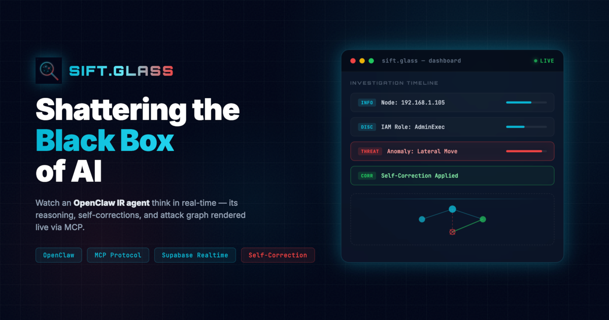

# SIFT.Glass — AI Incident Response Dashboard

> OpenClaw IR agent that livestreams threat-hunting reasoning to a visual attack graph. Built for the **FIND EVIL! 2026** hackathon.



---

## What it does

SIFT.Glass makes AI threat-hunting **visible and auditable**. As the OpenClaw agent investigates a SIEM alert, every hypothesis, tool call, and piece of evidence appears live in a React Flow attack graph. When the agent detects a false positive, the bad node **shatters** and the agent self-corrects in real time.

**Stack:** Next.js 16 · React 19 · React Flow · Tailwind · Supabase Realtime · Python + Claude API · MCP

---

## Architecture

```mermaid
graph TD
    %% Define security boundaries
    subgraph "Trust Boundary: Local SIFT Workstation (Secure Enclave)"
        Agent["OpenClaw IR Agent (Python)"]
        SIEM["Local SIEM / Logs"]
        Tools["Forensic Tools (Plaso, Volatility)"]
    end

    subgraph "Trust Boundary: State Management"
        MCP["MCP Server"]
        Supabase["Supabase (PostgreSQL + Realtime)"]
    end

    subgraph "Trust Boundary: Visualization (Web)"
        NextJS["Next.js App Router Dashboard"]
        ReactFlow["React Flow Visualization"]
    end

    %% Define connections
    SIEM -->|"Alert Trigger"| Agent
    Tools -->|"Artifacts"| Agent
    Agent -->|"Tool Calls"| MCP
    MCP -->|"SQL Writes"| Supabase
    Supabase -.->|"Realtime Subscriptions"| NextJS
    NextJS -->|"Render Graph"| ReactFlow
    
    %% Styling
    classDef boundary fill:transparent,stroke:#06b6d4,stroke-width:2px,stroke-dasharray: 5 5
    class "Trust Boundary: Local SIFT Workstation (Secure Enclave)" boundary
    class "Trust Boundary: State Management" boundary
    class "Trust Boundary: Visualization (Web)" boundary
```

> **Note on Platform Compatibility**: For details on how SIFT.Glass integrates natively with the SANS SIFT Workstation for the Find Evil 2026 Hackathon, please read the [SIFT Integration Guide](SIFT_INTEGRATION.md).

---

## Local Setup

### 1. Prerequisites

- Node.js 20+ and pnpm
- Python 3.11+
- [Supabase CLI](https://supabase.com/docs/guides/cli) (`brew install supabase/tap/supabase`)
- Anthropic API key

### 2. Clone and install frontend

```bash
git clone https://github.com/edycutjong/siftglass
cd siftglass
pnpm install
```

### 3. Configure environment

```bash
cp .env.local.example .env.local
```

Edit `.env.local`:

```
NEXT_PUBLIC_SUPABASE_URL=http://127.0.0.1:54321
NEXT_PUBLIC_SUPABASE_ANON_KEY=<your-anon-key>
SUPABASE_SERVICE_ROLE_KEY=<your-service-role-key>
ANTHROPIC_API_KEY=<your-anthropic-key>
```

For local Supabase dev, the anon key and service role key are printed when you run `supabase start`.

### 4. Start Supabase locally

```bash
supabase start
supabase db reset   # applies all migrations including the SIFTGlass schema
```

### 5. Start the frontend

```bash
pnpm dev
# → http://localhost:3000
```

The app shows the hardcoded demo scenario by default. It switches to **AGENT LIVE** mode automatically when the Python agent is running.

### 6. Set up the Python agent

```bash
cd agent
python -m venv .venv
source .venv/bin/activate      # Windows: .venv\Scripts\activate
pip install -r requirements.txt
```

### 7. Run the agent

In a second terminal (with the venv active):

```bash
cd agent
python agent.py
```

The agent will:
1. Create a new investigation session
2. Call Claude claude-sonnet-4-6 to drive the investigation
3. Write nodes, edges, and logs to Supabase via MCP tools
4. The frontend updates in real time — including the self-correction shatter animation

To replay with a specific session ID:

```bash
python agent.py --session <uuid>
```

To watch the frontend subscribe to an existing session, append `?session=<uuid>` to the URL.

---

## Running the demo

Open two terminal windows side by side (split-screen for video recording):

**Terminal 1 — frontend:**
```bash
pnpm dev
```

**Terminal 2 — agent:**
```bash
cd agent && python agent.py
```

The agent logs its tool calls to stdout. The React Flow graph and terminal panel update live as the agent investigates.

---

## Project structure

```
/app
  └── page.tsx              # Dashboard: React Flow + Realtime subscriptions
/components/soc
  ├── AgentBanner.tsx        # Top bar: phase, objective, reasoning, confidence
  ├── InvestigationNode.tsx  # Custom node with status styling and confidence bar
  └── TerminalPanel.tsx      # Terminal log viewer
/lib
  ├── types.ts               # Shared TypeScript types
  ├── demo-data.ts           # Hardcoded golden-path fallback scenario
  └── supabase.ts            # Supabase client (lazy, safe when unconfigured)
/agent
  ├── agent.py               # OpenClaw agent — Claude drives the investigation
  ├── mcp_server.py          # MCP server with IR tools (report_node, cancel_hypothesis, etc.)
  ├── mock_siem.py           # Mock SIEM alert for the golden-path scenario
  └── requirements.txt
/supabase/migrations
  ├── 20230530034630_init.sql           # Original template (users/stripe)
  └── 20260425000000_siftglass.sql      # SIFTGlass schema (nodes, edges, agent_state, terminal_lines)
```

---

## MCP Tools

| Tool | Description |
|------|-------------|
| `set_session` | Initialize an investigation session |
| `report_node` | Add an artifact node to the graph |
| `update_node_status` | Update node status (investigating → malicious/benign) |
| `add_edge` | Add a relationship edge between nodes |
| `hash_constraint_check` | Validate a SHA256 hash against threat intel |
| `domain_reputation` | Check domain reputation (detects false positives) |
| `cancel_hypothesis` | Shatter a false-positive node and remove its edges |
| `update_agent_state` | Update the dashboard banner |
| `log_terminal` | Append a line to the terminal panel |

---

## License

MIT
